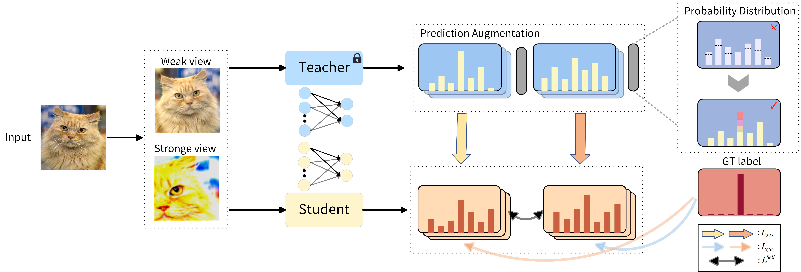

## ECKD: Error Correction Knowledge Distillation from a Dual Perspective


### Abstract

Logit-based distillation represents a powerful paradigm for knowledge transfer, where a student learns from a teacher’s high-dimensional logit distribution. However,  teachers are not infallible: despite achieving strong overall accuracy, their predictions remain imperfect on standard benchmarks, and the resulting logits  may  be biased for some samples. When  these  biased teacher logits conflict with ground-truth labels,
			the student can be misled, injecting noise  into the learning process and creating conflicts between the distillation loss and the cross-entropy loss. Most existing approaches implicitly treat the teacher as a perfectly trustworthy oracle, thereby allowing its errors to contaminate the distillation signal. In this paper, we  provides a new perspective to address this limitation by proposing Error-Correcting Knowledge Distillation (ECKD), a framework that integrates two complementary interventions designed to mitigate the impact of teacher bias. First, probability calibration adjusts the teacher’s predictive distribution using the ground-truth labels to mitigate misleading supervision. Second, a dual-view data selection strategy filters out samples with large prediction bias, reducing the impact of erroneous teacher guidance. The complementary interventions effectively addresses overconfidence issues of teach model in logit-based distillation method. Extensive experiments on CIFAR-100, Tiny-ImageNet, and ImageNet-1K show that ECKD achieves highly competitive performance, consistently matching or exceeding the accuracy of prior knowledge distillation methods across various settings.

### Installation

Environments:

- Python 3.8
- PyTorch 1.7.0

Install the package:

```
sudo pip3 install -r requirements.txt
sudo python3 setup.py develop
```

### ECKD Framework

<div style="text-align:center"></div>

### CIFAR-100


- Download the `cifar_teachers.tar` at <https://github.com/megvii-research/mdistiller/releases/tag/checkpoints> and untar it to `./download_ckpts` via `tar xvf cifar_teachers.tar`.

  ```bash
  python3 tools/train_ours.py --cfg configs/cifar100/eckd/res32x4_res8x4.yaml 
  ```

### Training on Tiny-ImageNet

- Download the dataset at <http://cs231n.stanford.edu/tiny-imagenet-200.zip> and put them to `./data/tiny-imagenet-200`

  ```bash
  python3 tools/train_ours.py --cfg configs/tinyimagenet200/eckd/r34_r18.yaml
  ```

### Training on ImageNet

- Download the dataset at <https://image-net.org/> and put them to `./data/imagenet`

  ```bash
  python3 tools/train_ours.py --cfg configs/imagenet/r34_r18/eckd.yaml
  ```

# Weight
The weights of student models are available at [Baidu](https://pan.baidu.com/s/1Y-6bKb8iZg8JC80L3QMIOw?pwd=e82i) or [Google](https://drive.google.com/file/d/1oD30nuL03w1eCFVCcWMHByYeEotyHBaU/view?usp=sharing).

# Acknowledgement
Thanks for the contributions to the codebase. The code is built on [mdistiller](<https://github.com/megvii-research/mdistiller>) and [mlkd](<https://github.com/Jin-Ying/Multi-Level-Logit-Distillation>).

# Contact

Yu Wang: 230421103.stu.xpu.edu.cn

# Citation

If this repo is helpful for your research, please consider citing the paper:

```BibTeX

@article{eckd2026,
  title={ECKD: Error Correction Knowledge Distillation from a Dual Perspective},
  author={Yu Wang, Minqi Li, Kaibing Zhang, Xiangjian He, Xiaomin Ma},
  journal={},
  volume={},
  number={},
  pages={},
  year={2026},
  publisher={}
}

```
